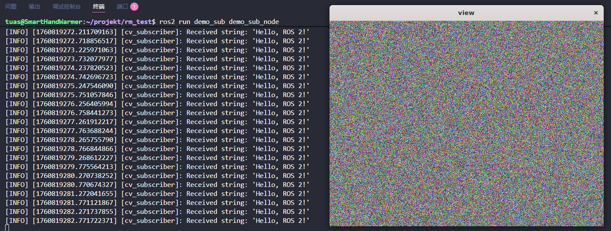
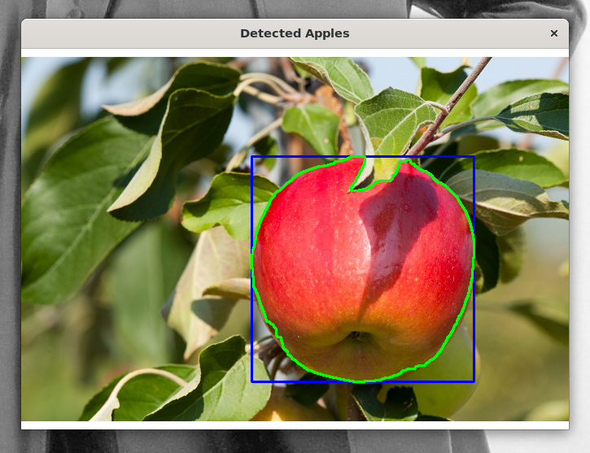

# SCAU Taurus 2025 Fall 视觉组考核完成情况总结

- 填写者：张坤
- 数学与信息学院 / 2023 级计算机科学与技术 3 班 / 202325310328

## 开发环境

- 系统：Ubuntu 22.04 on WSL2 (Kernel: 6.6.87.2-1)
- 运行时：
  - OpenCV: 4.11.0
  - opencv-contrib: 4.11.0
  - ROS2: humble
- 工具链：
  - CMake 3.22.1
  - Make 4.3
  - colcon (core: 0.20.0)
  - g++ 11.4.0
  - gdb 12.1
  - Optional:
    - clangd 12.0.1
    - clang-format 14.0.0

## 项目结构

``` 
.
├── .clang-format
├── LICENSE
├── README.md
├── 赛事知识题.md
├── asset
└── src
    ├── cv_related
    │   ├── CMakeLists.txt
    │   ├── apple_detect.cpp  # 苹果轮廓提取
    │   ├── armor.cpp         # 装甲板对象设计
    │   ├── calibration.cpp   # 相机标定
    │   ├── color_matcher.cpp # 色块提取
    │   ├── defog.cpp         # 图片去雾
    │   ├── mouse_event.cpp   # 鼠标事件
    │   ├── recorder.cpp      # 视频录制
    │   ├── res               # cv_related 中代码运行时用得到的一些资源
    │   └── utils             # 杂项代码，用于调试OpenCV的配置
    └── ros_related # ROS 工作空间 
        ├── res                    # armor_pipeline 功能包中节点运行时用得到的一些资源
        │   └── pipe_params.yaml   # armor_pipeline 功能包中节点的参数
        └── src
            ├── armor_detect   # ROS无关的装甲检测算法库，用colcon打包
            ├── armor_pipeline # 装甲检测节点
            ├── demo_pub       # 发布原数据类型为cv::Mat与std::string话题的节点
            └── demo_sub       # 订阅原数据类型为cv::Mat与std::string话题的节点

```
## 考核完成度
1. 赛事知识题：全部完成
2. C++应用题：全部完成
3. ROS2基本应用：全部完成
4. OpenCV:
    - 基础题：全部完成
    - 应用题：全部完成
    - 赛事题：
        - 装甲板识别：仅未完成测距
        - 能量机关识别：未完成
5. 深度学习：未完成

## 考核完成思路
### 1. 赛事知识题
见 [赛事知识题.md](赛事知识题.md) 
### 2. C++应用题
见 [armor.cpp](./src/cv_related/armor.cpp)
### 3. ROS2基本应用
> 工作空间：[src/ros_related](./src/ros_related/) <br/> 功能包：[demo_pub](./src/ros_related/src/demo_pub/) (发布者) 、[demo_sub](./src/ros_related/src/demo_sub/) (订阅者)
#### 3.1 话题的设计
这两个功能包中的节点分别发布与订阅两个话题：`rand_px` (原数据类型为`cv::Mat`)、`sim_str` (原数据类型为`std::string`)。<br/>
`rand_px` 话题传输的数据类型为 `sensor_msgs::msg::Image`；发布节点使用 `cv_bridge::CvImage::toImageMsg()` 将 `cv::Mat` 转换为该消息并发布，订阅节点则通过 `cv_bridge::toCvCopy()` 将接收到的 `Image` 转回 `cv::Mat` 以供后续处理。<br/>
`sim_str` 话题传输的数据类型为 `std_msgs::msg::String`；该类型可以直接与`std::string`进行互相转换。
#### 3.2 原始数据的生成
[`demo_pub.cpp`](./src/ros_related/src/demo_pub/src/demo_pub.cpp) 中定义了发布节点 `MininalCVPublisher`，该节点中包含两个用于储存原数据的成员： `cv::Mat raw_image_` 与 `std::string raw_str_`。`raw_image_` 的尺寸为 640 x 480，图像内容通过 `cv::randu()` 随机生成。`raw_str_` 的内容则在节点构造时确定。 
#### 3.3 原始数据的可视化
[`demo_sub.cpp`](./src/ros_related/src/demo_sub/src/demo_sub.cpp) 中定义了订阅节点 `MinimalCVSubscriber`， 该节点中两个用于储存原数据的成员的定义与 `MinimalCVPublisher` 中的完全相同。该节点仅对 `raw_image_` 进行了可视化，通过 `cv::imshow()` 实现；`raw_string_` 则直接在控制台中输出。
#### 3.4 参数
上述的两个节点没有定义任何参数，但 [`armor_pipeline`](./src/ros_related/src/armor_pipeline/) 功能包中的节点都定义了一些参数，详见 [4.6](#design_of_params)。<!--TODO: link to more detailed part -->
#### 3.5 运行效果
<p align="center">
  
</p>

### 4. OpenCV
#### _基础题_
#### 4.1 色彩分割
> source: [color_matcher.cpp](./src/cv_related/color_matcher.cpp)

该程序先将原图转换为 HSV 空间，然后利用 `cv::inRange()` 获得仅保留红色块的掩膜 `cv::Mat red_mask`。对 `red_mask` 分别进行 Canny 边缘检测与外部轮廓检测（`cv::findContours()`）。过滤掉过小的轮廓后，在原图上绘制出来并对检测结果进行保存。
- 样例检测结果：<br/>
  <p align="center">
    
  </p>
#### 4.2 视频录制
> source: [recoder.cpp](./src/cv_related/recorder.cpp)

1. 摄像头的连接：<br/>
由于我使用的开发环境是基于WSL的，连接摄像头是个相对麻烦的事情。我是通过 `usbipd` 将宿主机上的摄像头附加到 WSL 上的，具体方法参见 [usbipd-win WSL Support](https://github.com/dorssel/usbipd-win/wiki/WSL-support)。
> [!CAUTION] 
> 需要将WSL更新至最新版本来支持摄像头，否则可能要重新编译WSL内核来实现相关支持

2. 关于摄像头：<br/>
我使用的摄像头是笔记本内置的，故没有实现调节曝光。其它实现细节请参阅源码。
- 录制出的视频：<br/>
  <p align="center">
    
  </p>

#### 4.3 鼠标事件
> source: [mouse_event.cpp](./src/cv_related/mouse_event.cpp)

该源码中定义了 `RoiSelector` 类来实现鼠标事件的响应与 ROI 提取。类成员函数 `reactor()` 中具体定义了程序响应鼠标事件的行为，并通过静态类成员函数 `callback()` 来实现 `reactor()` 对 静态转发，以符合 `cv::setOnMouseCallack()` 对回调函数的签名。

其它实现细节请参阅源码。

- 运行效果：<br/>

https://github.com/user-attachments/assets/84076adb-0769-4d0e-943d-e71d3e29beb1

[下载视频](./asset/vid/mouse-event.mp4)

#### _应用题_
#### 4.4 苹果检测
> source: [apple_detect.cpp](./src/cv_related/apple_detect.cpp)

该程序的检测原理与 [4.1](#41-色彩分割) 中的类似，但是不进行 Canny 检测，且在获得掩膜前对图像进行了高斯模糊处理，同时在进行 `cv::findContours()` 前先对掩膜进行了一些形态学处理，以去除图片中的噪点，使得检测出来的轮廓更加平滑。然后从面积以及圆度 ( $\mathrm{Circularity} = 4 \pi S / P^2 \quad P \Leftrightarrow \mathrm{Perimeter}$ ) 对获得轮廓进行过滤，最后对目标轮廓执行 `cv::boundingRect()` 来获得它们的外部边框，并在原图中绘制出来。

该源码使用一个函数 `HSV_calib()`，通过创建滑条来手动确定 HSV 的大致范围。来源：[如何检测色彩边缘](https://harry-hhj.github.io/posts/RM-Tutorial-3-Getting-Started-with-OpenCV/#4%E8%A1%A5%E5%85%85%E6%A3%80%E6%B5%8B%E9%A2%9C%E8%89%B2%E8%BE%B9%E7%BC%98) 

该程序原先尝试使用 Haar 级联分类器来进行识别 ( 来源：[使用OpenCV中的分类器和颜色识别的苹果位置识别](https://blog.csdn.net/qq_40624111/article/details/118698092) )， 可惜测试样例中的苹果存在一定的遮挡，导致该分类器的识别命中率非常低。我也尝试过利用 OpenCV 官方提供的 [train_hog.cpp](https://docs.opencv.org/4.11.0/d0/df8/samples_2cpp_2train_HOG_8cpp-example.html) 来训练模型，但是由于训练集选的不太合适导致效果同样不是很好。

- 样例检测结果：<br/>
  <p align="center">
    
  </p>

#### 4.5 相机标定
> source: [calibration.cpp](./src/cv_related/calibration.cpp) <br/> 
> 参考：1. [基于OpenCV的相机标定](https://blog.csdn.net/LuohenYJ/article/details/104697062) 
> 2. [OpenCV 相机标定（实现以及标定流程)](https://www.cnblogs.com/ybqjymy/p/15930982.html)

1. 棋盘格图像的获取<br/>
   为了保证标定时所使用的照片的相机参数与实际录像时的相机参数是一致的，我设计了一个简单的[小程序](./src/cv_related/utils/get_pic.cpp)。它通过 OpenCV 的 `cv::videoCapture()` 来截取50张尺寸为 960 x 540 的图片，再从中挑选出15-20张成像清晰的以供相机标定程序使用。

2. 相机的标定<br/>
   对于选定的一组照片，程序先通过 `cv::findChessboardCorners()` 寻找图片中棋盘的角点，并用 `cv::cornerSubPix()` 对这些角点的位置进行进一步的校正。之后利用 `cv::calibrateCamera()` 根据获得的所有角点与校正后角点对应的三维坐标来获得相机的内、外参与畸变系数，最后通过 `cv::FileStorage` 将这些参数保存到 [.yml](./src/cv_related/res/calib.yml) 文件中以便后续的使用。 

#### _赛事题_
#### 4.6 装甲板识别
> 工作空间：[src/ros_related](./src/ros_related/) <br/> 
> 功能包：[armor_detect](./src/ros_related/src/armor_detect/) (ROS无关的装甲检测库)、[armor_pipeline](./src/ros_related/src/armor_pipeline/) (图像获取与装甲检测节点) <br/>
> 节点运行时所需要的资源：[ros_related/res](./src/ros_related/res/)

- __armor_detect__
> 参考：
> 1. 装甲检测：[吉林大学 TARS-GO 战队 2020 年视觉代码](https://github.com/QunShanHe/JLURoboVision)
> 2. 数字识别：[华中科技大学狼牙战队 2022 年步兵视觉](https://github.com/XianMengxi/AutoAim_HUST)

`armor_detect` 是一个 ROS 无关的装甲检测库。在 ROS 独立的环境中完成开发与验证后，用 colcon 将其打包为静态库，以供其它 ROS 功能包直接调用。

1. 文件结构
    ```
    ./src/ros_related/src/armor_detect/
    ├── CMakeLists.txt
    ├── include
    │   └── armor_detect
    │       ├── armor
    │       │   ├── armorPad.h      # 装甲板类头文件
    │       │   ├── armorParam.h    # 装甲板识别参数头文件
    │       │   ├── detector.h      # 装甲板识别类头文件
    │       │   ├── lightBar.h      # 灯条类头文件
    │       │   └── numClassifier.h # 数字识别类头文件
    │       └── utils
    │           ├── timer.h # 计时器头文件，定义了时间结构体与一个 RAII 计时器类
    │           └── utils.h # 定义了全局调试 flags 与其它常用的函数
    ├── package.xml
    └── src
        ├── armor
        │   ├── armorPad.cpp
        │   ├── armorParam.cpp
        │   ├── detector
        │   │   ├── debugInfo.cpp # 装甲板识别类调试信息源文件
        │   │   └── detect.cpp    # 装甲板识别类识别函数源文件
        │   ├── lightBar.cpp
        │   └── numClassifier.cpp
        └── utils
            └── utils.cpp
    ```
2. 装甲板识别流程<br/>
  `armor_detect` 的装甲板识别基本参照吉林大学 2020 年识别方案，并进行了一些改动与调整，以期实现更稳定与快速的识别。

    __*图像预处理：*__

    预处理的目标是把原始 BGR 帧转换为只保留“敌方灯条”像素的二值掩码，以便后续轮廓拟合与灯条检测。`detect.cpp` 的 [`preprocess()`](./src/ros_related/src/armor_detect/src/armor/detector/detect.cpp#L42) 函数实现了图像预处理，它对对每个像素根据颜色分量差值（ R-B / B-R ）与亮度阈值判断，满足条件就把对应二值图像像素置 255；像素遍历用 `cv::parallel_for_()` 并行加速。

    __*灯条识别：*__
    
    `detect.cpp` 的 [`detectLights()`](./src/ros_related/src/armor_detect/src/armor/detector/detect.cpp#L123) 函数实现了灯条识别。它先对预处理后得到的二值掩膜进行外部轮廓检测 ( `cv::findContours()` )。筛除过小的轮廓后，使用 `cv::fitEllipse()` 进行椭圆拟合来获得旋转矩阵 `cv::RotatedRect`，然后计算该轮廓的密实度(即是否相对笔直)，若密实度满足条件则利用获得的旋转矩阵构造灯条实例 `armor::LightBar`。在过滤掉倾角过大以及宽高比不再阈值内的灯条后，按照灯条中心从左到右排序。轮廓遍历用 `cv::parallel_for_()` 并行加速。

    __*装甲板匹配：*__

    `detect.cpp` 的 [`detectArmors()`](./src/ros_related/src/armor_detect/src/armor/detector/detect.cpp#L191) 函数实现了装甲板识别，它通过对已检测到的灯条两两配对生成候选装甲。
    
    `detectArmors()` 按照灯条横向顺序两重循环尝试配对，并在横向距离比超过阈值时提前跳出内循环以剪枝不合理配对。它对每个候选用 ArmorPad 的一系列几何约束（长宽比、角度差、长度差比、偏角与位置比等）判断其是否合适，合格的候选会记录左右索引并用分类器在原图上识别数字赋值后加入结果列表。随后调用去重逻辑  `moveRepeatArmors()`，对应冲突的匹配，它总保留水平偏角更小的那一个。

    __*数字识别：*__
    `armor_detect` 的数字识别基本参照华中科技大学 2022 年的识别方案，具体实现在 [`numClassifier.cpp`](./src/ros_related/src/armor_detect/src/armor/numClassifier.cpp) 中。

    `armor::numClassifier` 利用匹配好的装甲板的顶点与长宽来获得装甲板在原图中 ROI 大小与位置，并进行裁切。通过 `cv::warpPerspective()` 将 ROI 进行仿射变换，然后将变换后的 ROI 图像缩放到目标尺寸，将其转换为灰度图并进行 Gamma 校正。对处理过的灰度图计算 HOG 描述子，把获得的描述子向量转换为单行 `cv::Mat` 矩阵后投入预训练的 SVM 模型进行识别。
    
- __armor_pipeline__
  
1. 话题的设计<br/>
   该功能包中包含两个话题：`vid_frame` (原数据类型为 `cv::Mat`)、`playing_stat` (原数据类型为 `bool`)。前者用于传输视频帧信息，后者用于传输视频的播放状态。

   `vid_frame` 传输的数据类型方式与 [3.1](#31-话题的设计) 中的 `rand_px` 完全相同。 

   `playing_stat` 传输的数据类型为 `std_msgs::msg::Bool`，该类型可以直接与 `bool` 进行互相转换。

<a id="design_of_params"></a>

2. 参数的设计<br/>
   `FrameCapture` 与 `ArmorFinder` 节点在构造时通过 `rclcpp::Node::declare_parameter()` 声明了可配置的参数。`FrameCapture` 声明了 `vid_path`，`playing`，`loop_display`；`ArmorFinder` 声明了 `enemy_color`，`model_path`。参数值皆可以通过 ROS2 参数接口动态设置。

   `ArmorFinder` 使用 `rclcpp::Node::add_on_set_parameters_callback()` 注册回调；回调对传入参数做校验，在校验通过时立即把新配置应用到 `armor::Detector detector_`，否则返回失败并拒绝修改。

   `FrameCapture` 在定时器回调中每次读取参数值并据此控制视频打开、播放与循环（改变 `vid_path` 会尝试打开新文件，失败时通过 `rclcpp::Node::set_parameter()` 回滚），并通过成员变量 `playing_stat_pub_` 发布当前播放状态。

   两者通过 ROS 话题交互：`FrameCapture` 发布 `vid_frame` 与 `playing_stat`，`ArmorFinder` 订阅 `vid_frame` 获取并用 `cv_bridge` 转回 `cv::Mat` 处理，订阅 `playing_stat` 以更新本地 `is_playing_`，从而实现参数的闭环控制。

- __运行效果__


  [下载视频](./asset/vid/pipeline_test.mp4)


