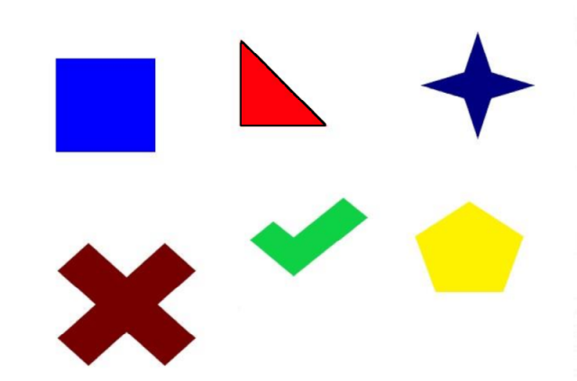

# SCAU Taurus 2025 Fall 视觉组考核完成情况总结

- 填写者：张坤
- 数学与信息学院 / 2023 级计算机科学与技术 3 班 / 202325310328

## 开发环境

- 系统：Ubuntu 22.04 on WSL2 (Kernel: 6.6.87.2-1)
- 运行时：
  - OpenCV: 4.11.0
  - opencv-contrib: 4.11.0
  - ROS2: humble
- 工具链：
  - CMake 3.22.1
  - Make 4.3
  - colcon (core: 0.20.0)
  - g++ 11.4.0
  - gdb 12.1
  - Optional:
    - clangd 12.0.1
    - clang-format 14.0.0

## 项目结构

``` 
.
├── .clang-format
├── LICENSE
├── README.md
├── 赛事知识题.md
├── asset
└── src
    ├── cv_related
    │   ├── CMakeLists.txt
    │   ├── apple_detect.cpp  # 苹果轮廓提取
    │   ├── armor.cpp         # 装甲板对象设计
    │   ├── calibration.cpp   # 相机标定
    │   ├── color_matcher.cpp # 色块提取
    │   ├── defog.cpp         # 图片去雾
    │   ├── mouse_event.cpp   # 鼠标事件
    │   ├── recorder.cpp      # 视频录制
    │   ├── res               # cv_related 中代码运行时用得到的一些资源
    │   └── utils             # 杂项代码，用于调试OpenCV的配置
    └── ros_related # ROS 工作空间 
        ├── res                    # armor_pipeline 功能包中节点运行时用得到的一些资源
        │   └── pipe_params.yaml   # armor_pipeline 功能包中节点的参数
        └── src
            ├── armor_detect   # ROS无关的装甲检测算法库，用colcon打包
            ├── armor_pipeline # 装甲检测节点
            ├── demo_pub       # 发布原数据类型为cv::Mat与std::string话题的节点
            └── demo_sub       # 订阅原数据类型为cv::Mat与std::string话题的节点

```
## 考核完成度
1. 赛事知识题：全部完成
2. C++应用题：全部完成
3. ROS2基本应用：全部完成
4. OpenCV:
    - 基础题：全部完成
    - 应用题：全部完成
    - 赛事题：
        - 装甲板识别：仅未完成测距
        - 能量机关识别：未完成
5. 深度学习：未完成

## 考核完成思路
### 1. 赛事知识题
见 [赛事知识题.md](赛事知识题.md) 
### 2. C++应用题
见 [armor.cpp](./src/cv_related/armor.cpp)
### 3. ROS2基本应用
> 工作空间：[src/ros_related](./src/ros_related/) <br/> 功能包：[demo_pub](./src/ros_related/src/demo_pub/) (发布者) 、[demo_sub](./src/ros_related/src/demo_sub/) (订阅者)
#### 3.1 话题的设计
这两个功能包中的节点分别发布与订阅两个话题：`rand_px` (原数据类型为`cv::Mat`)、`sim_str` (原数据类型为`std::string`)。<br/>
`rand_px` 话题传输的数据类型为 `sensor_msgs::msg::Image`；发布节点使用 `cv_bridge::CvImage::toImageMsg()` 将 `cv::Mat` 转换为该消息并发布，订阅节点则通过 `cv_bridge::toCvCopy()` 将接收到的 `Image` 转回 `cv::Mat` 以供后续处理。<br/>
`sim_str` 话题传输的数据类型为 `std_msgs::msg::String`；该类型可以直接与`std::string`进行互相转换。
#### 3.2 原始数据的生成
[`demo_pub.cpp`](./src/ros_related/src/demo_pub/src/demo_pub.cpp) 中定义了发布节点 `MininalCVPublisher`，该节点中包含两个用于储存原数据的成员： `cv::Mat raw_image_` 与 `std::string raw_str_`。`raw_image_` 的尺寸为 640 x 480，图像内容通过 `cv::randu()` 随机生成。`raw_str_` 的内容则在节点构造时确定。 
#### 3.3 原始数据的可视化
[`demo_sub.cpp`](./src/ros_related/src/demo_sub/src/demo_sub.cpp) 中定义了订阅节点 `MinimalCVSubscriber`， 该节点中两个用于储存原数据的成员的定义与 `MinimalCVPublisher` 中的完全相同。该节点仅对 `raw_image_` 进行了可视化，通过 `cv::imshow()` 实现；`raw_string_` 则直接在控制台中输出。
#### 3.4 参数
上述的两个节点没有定义任何参数，但 [`armor_pipeline`](./src/ros_related/src/armor_pipeline/) 功能包中的节点都定义了一些参数，详见 [4.6](#46-装甲板识别)。<!--TODO: link to more detailed part -->
#### 3.5 运行效果
<p align="center">
  
</p>

### 4. OpenCV
#### _基础题_
#### 4.1 色彩分割
> source: [color_matcher.cpp](./src/cv_related/color_matcher.cpp)

该程序先将原图转换为 HSV 空间，然后利用 `cv::inRange()` 获得仅保留红色块的掩膜 `cv::Mat red_mask`。对 `red_mask` 分别进行 Canny 边缘检测与外部轮廓检测（`cv::findContours()`）。过滤掉过小的轮廓后，在原图上绘制出来并对检测结果进行保存。
- 样例检测结果：<br/>
  <p align="center">
    
  </p>
#### 4.2 视频录制
> source: [recoder.cpp](./src/cv_related/recorder.cpp)

1. 摄像头的连接：<br/>
由于我使用的开发环境是基于WSL的，连接摄像头是个相对麻烦的事情。我是通过 `usbipd` 将宿主机上的摄像头附加到 WSL 上的，具体方法参见 [usbipd-win WSL Support](https://github.com/dorssel/usbipd-win/wiki/WSL-support)。
> [!CAUTION] 
> 需要将WSL更新至最新版本来支持摄像头，否则可能要重新编译WSL内核来实现相关支持

2. 关于摄像头：<br/>
我使用的摄像头是笔记本内置的，故没有实现调节曝光。其它实现细节请参阅源码。
- 录制出的视频：<br/>
  <p align="center">
    
  </p>

#### 4.3 鼠标事件
> source: [mouse_event.cpp](./src/cv_related/mouse_event.cpp)

该源码中定义了 `RoiSelector` 类来实现鼠标事件的响应与 ROI 提取。类成员函数 `reactor()` 中具体定义了程序响应鼠标事件的行为，并通过静态类成员函数 `callback()` 来实现 `reactor()` 对 静态转发，以符合 `cv::setOnMouseCallack()` 对回调函数的签名。

其它实现细节请参阅源码。

- 运行效果：<br/>

https://github.com/user-attachments/assets/84076adb-0769-4d0e-943d-e71d3e29beb1

[下载视频](./asset/vid/mouse-event.mp4)

#### _应用题_
#### 4.4 苹果检测
> source: [apple_detect.cpp](./src/cv_related/apple_detect.cpp)

该程序的检测原理与 [4.1](#41-色彩分割) 中的类似，但是不进行 Canny 检测，且在获得掩膜前对图像进行了高斯模糊处理，同时在进行 `cv::findContours()` 前先对掩膜进行了一些形态学处理，以去除图片中的噪点，使得检测出来的轮廓更加平滑。然后从面积以及圆度 ( $\mathrm{Circularity} = 4 \pi S / P^2 \quad P \Leftrightarrow \mathrm{Perimeter}$ ) 对获得轮廓进行过滤，最后对目标轮廓执行 `cv::boundingRect()` 来获得它们的外部边框，并在原图中绘制出来。

该源码使用一个函数 `HSV_calib()`，通过创建滑条来手动确定 HSV 的大致范围。来源：[如何检测色彩边缘](https://harry-hhj.github.io/posts/RM-Tutorial-3-Getting-Started-with-OpenCV/#4%E8%A1%A5%E5%85%85%E6%A3%80%E6%B5%8B%E9%A2%9C%E8%89%B2%E8%BE%B9%E7%BC%98) 

该程序原先尝试使用 Haar 级联分类器来进行识别 ( 来源：[使用OpenCV中的分类器和颜色识别的苹果位置识别](https://blog.csdn.net/qq_40624111/article/details/118698092) )， 可惜测试样例中的苹果存在一定的遮挡，导致该分类器的识别命中率非常低。我也尝试过利用 OpenCV 官方提供的 [train_hog.cpp](https://docs.opencv.org/4.11.0/d0/df8/samples_2cpp_2train_HOG_8cpp-example.html) 来训练模型，但是由于训练集选的不太合适导致效果同样不是很好。

- 样例检测结果：<br/>
  <p align="center">
    
  </p>

#### 4.5 相机标定
> source: [calibration.cpp](./src/cv_related/calibration.cpp) <br/> 
> 参考：1. [基于OpenCV的相机标定](https://blog.csdn.net/LuohenYJ/article/details/104697062) 
> 2. [OpenCV 相机标定（实现以及标定流程)](https://www.cnblogs.com/ybqjymy/p/15930982.html)

1. 棋盘格图像的获取<br/>
   为了保证标定时所使用的照片的相机参数与实际录像时的相机参数是一致的，我设计了一个简单的[小程序](./src/cv_related/utils/get_pic.cpp)。它通过 OpenCV 的 `cv::videoCapture()` 来截取50张尺寸为 960 x 540 的图片，再从中挑选出15-20张成像清晰的以供相机标定程序使用。

2. 相机的标定<br/>
   对于选定的一组照片，程序先通过 `cv::findChessboardCorners()` 寻找图片中棋盘的角点，并用 `cv::cornerSubPix()` 对这些角点的位置进行进一步的校正。之后利用 `cv::calibrateCamera()` 根据获得的所有角点与校正后角点对应的三维坐标来获得相机的内、外参与畸变系数，最后通过 `cv::FileStorage` 将这些参数保存到 [.yml](./src/cv_related/res/calib.yml) 文件中以便后续的使用。 

#### _赛事题_
#### 4.6 装甲板识别
> 工作空间：[src/ros_related](./src/ros_related/) <br/> 
> 功能包：[armor_detect](./src/ros_related/src/armor_detect/) (ROS无关的装甲检测算法库)、[armor_pipeline](./src/ros_related/src/armor_pipeline/) (图像获取与装甲检测节点) <br/>
> 节点运行时所需要的资源：[ros_related/res](./src/ros_related/res/)

- armor_detect
> 参考：
> 1. 装甲检测：[吉林大学 TARS-GO 战队 2020 年视觉代码](https://github.com/QunShanHe/JLURoboVision)
> 2. 数字识别：[华中科技大学狼牙战队 2022 年步兵视觉](https://github.com/XianMengxi/AutoAim_HUST)


- armor_pipeline

